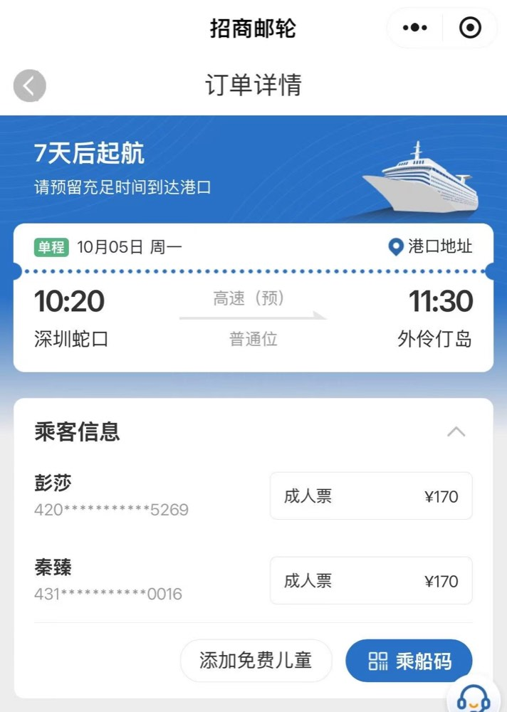
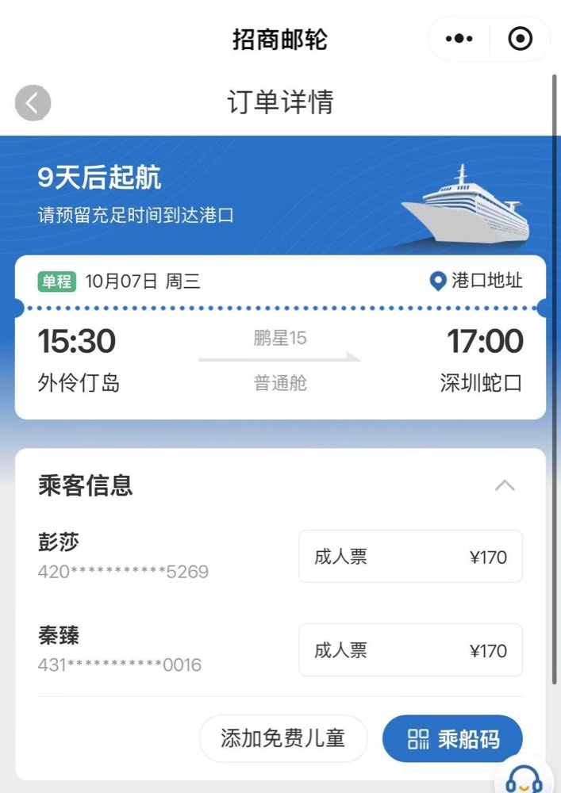
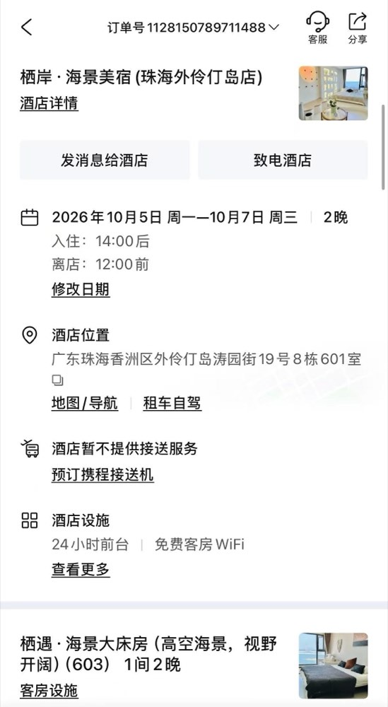
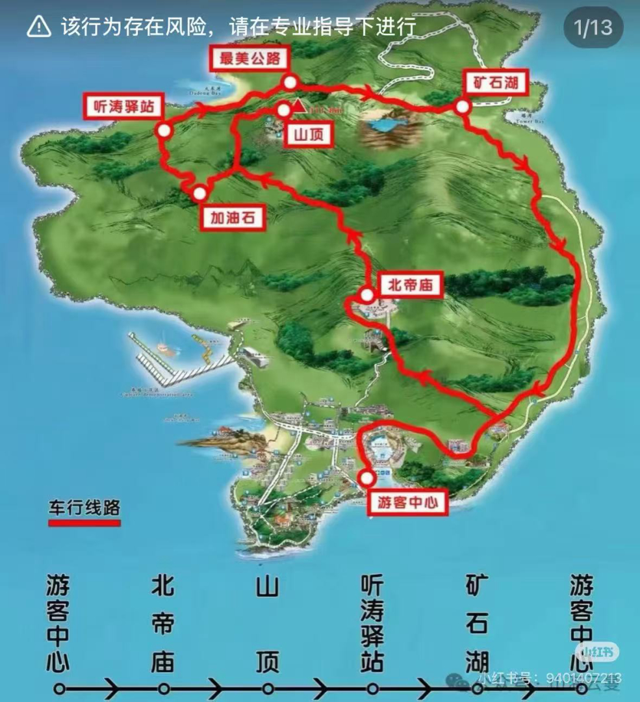
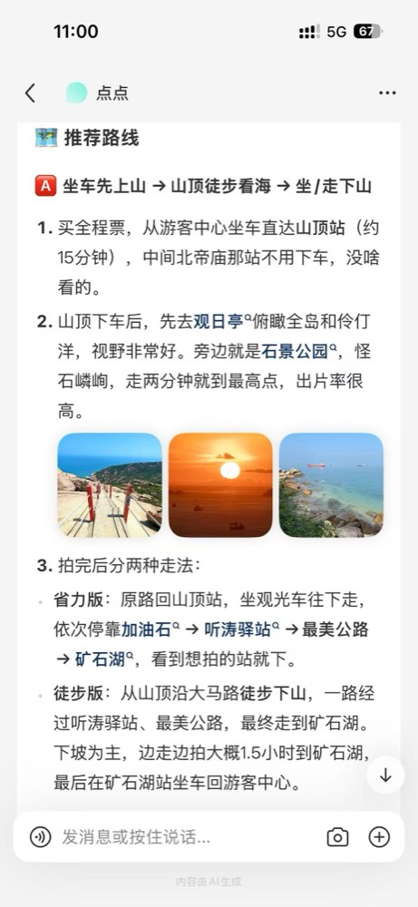
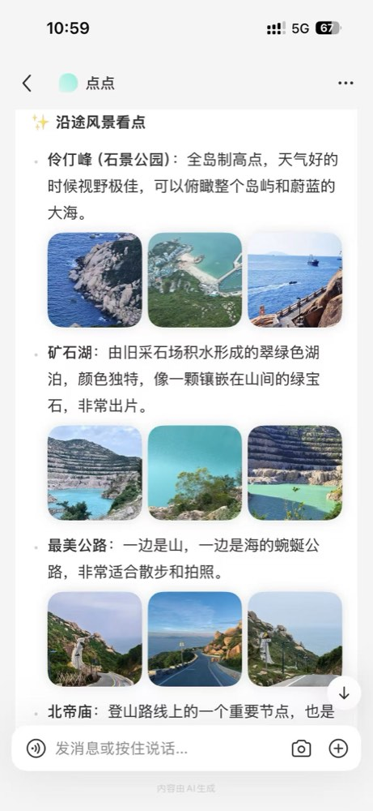
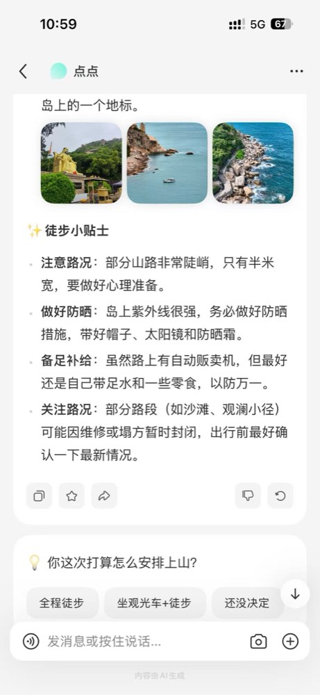
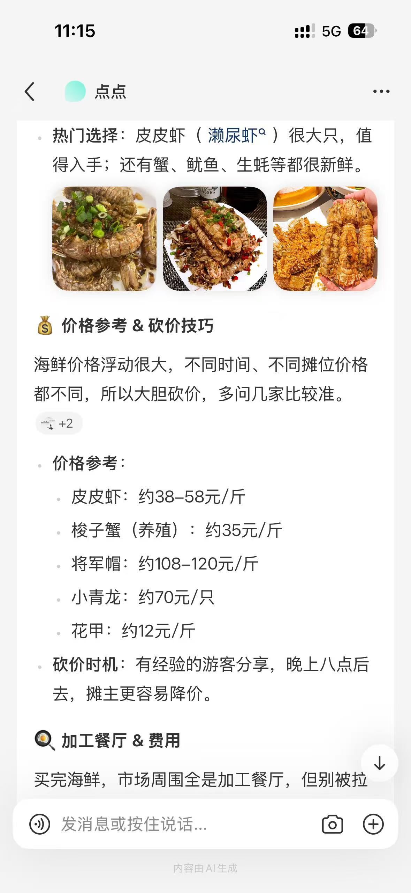

# 外伶仃岛 · 三天两夜

> 10 月 5 日—10 月 7 日｜深圳蛇口轮渡往返｜2 人
> 一天慢逛看海，一天登高看远景，一天慢慢收尾。每天只安排一件“正事”，其余时间留白。

## 往返船班

| 时间 | 事项 |
| --- | --- |
| **10 月 5 日 10:20 → 11:30** | **去程：蛇口 → 外伶仃岛** |
| **10 月 7 日 15:30 → 17:00** | **回程：外伶仃岛 → 蛇口** |

订单截图（去程 / 回程）

## 住宿：栖岸·海景美宿

| 项目 | 信息 |
| --- | --- |
| 名称 | 栖岸·海景美宿（珠海外伶仃岛店） |
| 日期 | 10 月 5 日—7 日，1 间 2 晚 |
| 房型 | 栖遇·海景大床房（高空海景） |
| 地址 | 珠海香洲区外伶仃岛涛园街 19 号 8 栋 601 室 |
| 接送 | **酒店有摆渡车，渡口 ↔ 酒店，到时候电话联系** |
| 已确认设施 | 24 小时前台、免费客房 WiFi |
| 待确认 | 早餐、行李寄存、电梯 |

订单截图（住宿）

**到店注意：** 页面地址写 **601 室**，房型标注 **603**，可能分别对应接待地址与房间标识，**先让民宿发准确定位和办理入住的位置**，不要想当然。

**10 月 4 日可在订单里“发消息给酒店”一次问清：**

> 你好，我们两位成人，10 月 5 日乘 10:20 的船、预计 11:30 抵岛，入住栖遇·海景大床房，7 日离店。麻烦发一下从码头到民宿的定位、步行路线和楼栋入口；页面地址是 601 室、房型标注 603，请问在哪里办理入住？是否有电梯？能否提前寄存行李、退房后寄存到约 14:00？订单是否含早餐？如官方停航，住宿订单如何处理？

## 三天行程

### Day 1｜10 月 5 日：上岛、看海、吃海鲜

| 时段 | 安排 | 提示 |
| --- | --- | --- |
| 上午 | 到蛇口邮轮中心，乘船登岛 | **预报有雨、北风 3-4 级，风浪偏大**；早餐吃一点点，晕船药提前一小时吃 |
| 中午 | 下船找民宿、安顿行李、简单吃午饭 | 民宿提供接送；行李先套防水袋 |
| 下午 | 办理入住，洗漱休息；再去石涌湾沙滩、双子亭一带散步拍照 | 下雨就只走镇上、码头周边等近处，远处步道改天 |
| 傍晚 | 玉带环腰沿海步道，找个开阔点一起看晚霞 | **雨天晚霞基本没戏，看天色决定，别硬等**；天黑前离开偏僻路段 |
| 晚上 | 海鲜晚餐，之后去伶仃湾广场、拱桥附近走走 | 在有照明的公共区域活动，早点回酒店休息 |

**游玩顺序：** 民宿 → 石涌湾沙滩 / 双子亭 → 玉带环腰开放步道 → 晚餐 → 伶仃湾广场、拱桥 → 回民宿。入口和连接路段以上岛后的导览牌为准。[景点位置与介绍](https://m.zh.bendibao.com/jingdian/zhuhaiwailingdao/content/)

**想留下的照片：** 船靠岸时的岛屿全景、海边双人合照、晚霞里的背影。第一天挑两三个喜欢的位置就够，别赶场。

### Day 2｜10 月 6 日：登高看海，下午彻底放松

| 时段 | 安排 | 提示 |
| --- | --- | --- |
| 早上 | 早餐补水 | 山上各站点基本没补给（仅矿石湖附近有） |
| 上午 | 游客中心乘观光车上山 → 观日亭、石景公园（伶仃峰顶）看海拍照 | **预报全天雨、22–24℃，山顶多为云雾。出发前先看天色与观光车是否运行，看不到远景就把主项挪到 7 日早上**（见[天气](#天气)）；坐车选左边靠海座位 |
| 中午 | 沿大马路观光车下山：听涛驿站 → 最美公路（加油石机位）→ 矿石湖 | 下坡为主；**雨天路面湿滑，只走大马路，不走近路** |
| 下午 | 矿石湖拍照，在矿石湖站坐观光车回游客中心 | 矿石湖附近可补水、稍作休息 |
| 傍晚 | 回到喜欢的海边点位，看海、补拍 | 也可以直接回房间躺着 |
| 晚上 | 海鲜大餐 | 雨天版：慢慢吃一顿，就是这天的正事 |

**登山路线（观光车 + 徒步）：**

观光车为环线：**游客中心 → 北帝庙 → 山顶 → 听涛驿站 → 矿石湖 → 游客中心**。

1. **山顶下车后先去观日亭**，俯瞰全岛和伶仃洋；旁边就是石景公园，怪石嶙峋，走两分钟到伶仃峰最高点，出片率很高。
2. **徒步下山（推荐徒步版 也可以一半徒步一半观光车）**：从山顶沿大马路往下走，下坡为主，途经听涛驿站、最美公路，边走边拍约 1.5 小时到矿石湖（旧采石场积水形成的翠绿色湖泊）。不想走可在山顶站原路坐车，依次停靠加油石 → 听涛驿站 → 最美公路 → 矿石湖，看到想拍的站就下。

**注意事项：**

- 观光车座位选**左边靠海**，吹海风看海景体验好很多。
- **最美公路的最佳拍照机位在加油石**，不要在"最美公路"那站下车
- 加油石有海风没遮阴、非常晒，快速拍照后回车上或去下一站。
- 岛上紫外线强，帽子、墨镜、防晒霜带齐；部分山路陡峭，只走大马路，**不把不明岔路当捷径**；

登山路线攻略截图

**想看日出：** 前一晚再查日出时间、天气和步道开放情况，只去民宿确认能安全到达的观景点。

### Day 3｜10 月 7 日：早餐、最后一次海边散步、回深圳

| 时段 | 安排 | 提示 |
| --- | --- | --- |
| 早上 | 慢慢吃早餐；若 6 日没能登山，**一早退房寄存行李、赶第一班观光车上山**，11:00 前下山 | 预报多云转晴 23–26℃，三天里最适合户外的一天 |
| 上午 | 海边散步，补拍喜欢的点位 | 不安排出海等耗时难控的项目；**风浪仍大，不靠礁石、不下水** |
| 中午 | 附近吃午饭 | 下午 15:30 的船，留出余量，随时能提前去码头 |

## 美食

**核心思路：去海鲜市场现买，再找餐厅加工**，比直接点菜新鲜又划算。

去哪儿买 & 吃什么

* 林姨糖水

- 岛上海鲜市场主要有两个：一个在**码头右手边**，另一个在**海滨浴场附近**，从住处走过去都不远。
- **伶仃三宝（岛上特色）：** 将军帽、狗爪螺、海胆。将军帽口感 Q 弹，很受欢迎；挑一两样尝尝即可，不必一次点齐。[海岛美食介绍](https://content.macaotourism.gov.mo/uploads/mgto_brochures/68fdeff1fdcf6aca24a5b36a8084a13f0e504b3f.pdf)
- **热门选择：** 皮皮虾（濑尿虾）很大只值得入手，还有蟹、鱿鱼、生蚝等都很新鲜。

海鲜市场与特色介绍截图

价格参考 & 砍价技巧

海鲜价格浮动很大，不同时间、不同摊位价格不同，**多问几家比价、大胆砍价**。

| 海鲜 | 参考价 |
| --- | --- |
| 皮皮虾 | 约 38–58 元/斤 |
| 梭子蟹（养殖） | 约 35 元/斤 |
| 将军帽 | 约 108–120 元/斤 |
| 小青龙 | 约 70 元/只 |
| 花甲 | 约 12 元/斤 |

- **砍价时机：** 有经验的游客分享，晚上八点后去，摊主更容易降价。
- **加工费：** 买完海鲜，市场周围全是加工餐厅，先谈好加工费再下单。

价格参考截图

避坑指南

- **防调包：** 自己亲手挑选，盯着商家装袋，防止活的被换成死的。
- **防注水：** 装袋后把袋子底部戳个洞沥干水再称重，避免为袋子里的水买单。
- **过公秤：** 市场旁边有公平秤和监督员，买完最好复称一下。
- **别乱点菜：** 除了海鲜，其他肉类菜品慎点，岛上肉类多为冷冻品，口感一般。

吃海鲜小结

1. **自己买：** 去海鲜市场，新鲜又划算。
2. **多比价：** 多问几家，大胆砍价。
3. **防猫腻：** 自己挑、过公秤、沥干水。
4. **选餐厅：** 别跟拉客的走，多对比几家加工费和口碑。

两个人吃省心起见，也可以直接选**明码标价**的餐馆；若去市场买了再加工，先确认购买价、称重单位和加工费再付款。

避坑指南截图

## 天气

> 预报核查于 **2026 年 9 月 28 日**，距出发 7 天。10 月 5—7 日这两天还落在"8—15 天客观预报"区间，**只能看趋势，不能当结论**；10 月 3 日、4 日、出发当天必须各看一次。

一句话结论

**三天都有 3-4 级北到东北风，前两天有雨、第三天转好。**按现在的趋势，原定的"第二天登高看远景"大概率要挪到第三天上午，这两天先按雨天版本准备。

三天预报速览（外伶仃岛）

| 日期 | 天气 | 气温 | 风 | 日出 / 日落 |
| --- | --- | --- | --- | --- |
| **10 月 5 日（一）** | 雨 | 22–28℃ | 北风 3-4 级 | 06:19 / 18:11 |
| **10 月 6 日（二）** | 雨，全天阴沉 | 22–24℃ | 北风 3-4 级 | 06:19 / 18:10 |
| **10 月 7 日（三）** | 多云转晴 | 23–26℃ | 东北风 3-4 级 | 06:19 / 18:09 |

深圳同三天：5 日雨 20–27℃、6 日阴转多云 20–24℃、7 日晴 20–26℃。**两地都凉，不是夏天那趟了。**

背景：珠海气象局 9 月 28 日发布，10 月 2 日受弱冷空气影响转阵雨、高温缓解，3—4 日多云为主；月底这股冷空气正是 5—6 日转北风、气温从前期的 31℃ 掉到 22–24℃ 的原因。26 号台风"舒力基"已减弱并趋向日本以南洋面，**不影响华南**；**但 10 月初南海仍可能有新台风生成，这是本次行程唯一需要盯的变数。**

## 出发清单

随身带

- [ ] 身份证原件
- [ ] 手机、充电器、充电宝
- [ ] 三天换洗衣物，帽子、墨镜
- [ ] **晕船药或晕船贴**（如果晕船的话，提前一小时用）
- [ ] 防晒用品
- [ ] 沙滩拖鞋
- [ ] 驱蚊用品
- [ ] 想下水再带泳衣和速干毛巾
- [x] 一次性床垫四件套
- [x] 小风扇
- [x] 防晒伞

---

> 这趟最值得留的三个时刻：第一天傍晚一起沿海散步，第二天从高处看海，离岛前坐下来慢慢吃一顿早餐。
